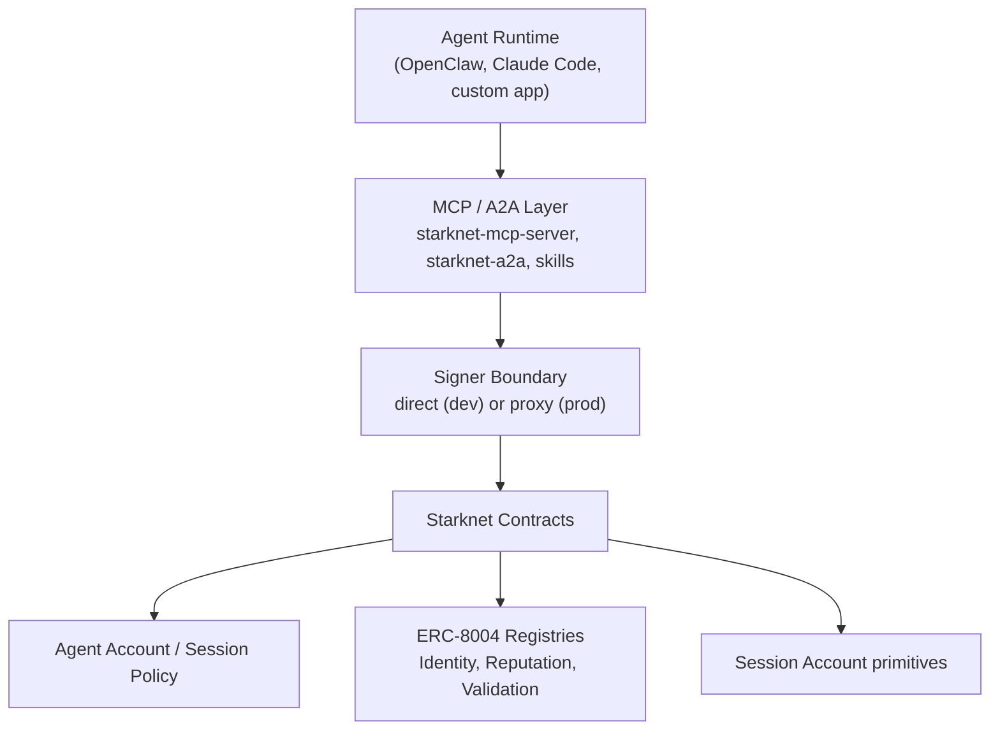

# Starknet Agentic

[](https://github.com/keep-starknet-strange/starknet-agentic/actions/workflows/ci.yml)
[](https://github.com/keep-starknet-strange/starknet-agentic/actions/workflows/codeql.yml)
[](./LICENSE)

Infrastructure for the Starknet agent economy: contracts, runtimes, and skills to run self-custodial AI agents with on-chain identity, policy-enforced execution, and composable tool access.

## Why This Exists

Most agent stacks treat wallets as add-ons. `starknet-agentic` treats wallets, identity, and execution policy as first-class system boundaries.

This repo gives you:

- account-level control rails (session keys, spending policy, revoke paths)
- ERC-8004 identity, reputation, and validation registries on Starknet
- MCP and A2A integration packages for agent runtimes
- reusable skills and end-to-end examples

## Fastest Path

If you just want Starknet agent capabilities now:

```bash
npx create-starknet-agent@latest
```

Sanity check (npm availability):

```bash
npm view create-starknet-agent version
```

The scaffolder detects your environment (OpenClaw/MoltBook, Claude Code, Cursor, or standalone) and wires Starknet integration automatically.

## System Requirements

- Node.js `>=20.9.0`
- `pnpm` (workspace package manager)
- Scarb + Starknet Foundry (for Cairo builds/tests)

## Choose Your Path

| Goal | Start here |
|---|---|
| Add Starknet tools to an existing agent | [`packages/create-starknet-agent`](./packages/create-starknet-agent/) |
| Run local no-backend onboarding demo | [`examples/onboard-agent`](./examples/onboard-agent/) |
| Run autonomous loop with MCP tools | [`examples/full-stack-swarm`](./examples/full-stack-swarm/) |
| Integrate on-chain identity/reputation | [`contracts/erc8004-cairo`](./contracts/erc8004-cairo/) |
| Build production signer boundary | [`packages/starknet-mcp-server`](./packages/starknet-mcp-server/) + external signer (proxy mode) |

## Architecture



## No-Backend Trust Model (Recommended Launch Profile)

Default launch profile is self-custodial and no-backend:

- users run agent runtime locally or on their own infra
- transaction policy is enforced on-chain by account contracts
- no central signer or shared custody by this project

For production environments, use MCP proxy signer mode rather than raw in-process private keys.

## Core Components

### Contracts

| Component | Path | What it does |
|---|---|---|
| Agent account contracts | [`contracts/agent-account`](./contracts/agent-account/) | Session keys, policy enforcement, ownership controls |
| ERC-8004 Cairo registries | [`contracts/erc8004-cairo`](./contracts/erc8004-cairo/) | Identity, reputation, validation primitives |
| Session-account primitives | [`contracts/session-account`](./contracts/session-account/) | Session-key account modules for policy-centric execution |
| Huginn registry | [`contracts/huginn-registry`](./contracts/huginn-registry/) | Additional registry primitives used by ecosystem demos |

### Packages

| Package | Path | Purpose |
|---|---|---|
| `create-starknet-agent` | [`packages/create-starknet-agent`](./packages/create-starknet-agent/) | Scaffolds/installs Starknet agent integration |
| `@starknet-agentic/mcp-server` | [`packages/starknet-mcp-server`](./packages/starknet-mcp-server/) | Starknet operations over MCP |
| `@starknet-agentic/a2a` | [`packages/starknet-a2a`](./packages/starknet-a2a/) | A2A protocol adapter |
| `@starknet-agentic/agent-passport` | [`packages/starknet-agent-passport`](./packages/starknet-agent-passport/) | ERC-8004 capability metadata helpers |
| `@starknet-agentic/x402-starknet` | [`packages/x402-starknet`](./packages/x402-starknet/) | Starknet payment signing utilities |
| `@starknet-agentic/onboarding-utils` | [`packages/starknet-onboarding-utils`](./packages/starknet-onboarding-utils/) | Shared onboarding helpers |

### Skills

Skill packs live in [`skills/`](./skills/). Browse full catalog and install flows in [`skills/README.md`](./skills/README.md).

Install one skill:

```bash
npx skills add keep-starknet-strange/starknet-agentic/skills/starknet-wallet
```

## Standards and Interop

| Standard | Purpose | Implementation |
|---|---|---|
| [MCP](https://modelcontextprotocol.io/) | Agent tool interface | `packages/starknet-mcp-server` |
| [A2A](https://a2a-protocol.org/) | Agent-to-agent messaging/workflows | `packages/starknet-a2a` |
| [ERC-8004](https://eips.ethereum.org/EIPS/eip-8004) | Agent identity/reputation/validation | `contracts/erc8004-cairo` |

Parity and Starknet-specific behavior for ERC-8004 is documented in [`docs/ERC8004-PARITY.md`](./docs/ERC8004-PARITY.md).

## Quickstart From Source (Contributors)

### 1) Install

```bash
pnpm install
```

### 2) Build and test JS/TS workspace

```bash
pnpm build
pnpm test
```

### 3) Run Cairo checks

```bash
cd contracts/erc8004-cairo && scarb build && snforge test
cd ../agent-account && scarb build && snforge test
cd ../session-account && scarb build && snforge test
```

### 4) Run a minimal E2E demo

```bash
# from repo root
pnpm demo:hello-agent
```

Demo setup details: [`examples/hello-agent/README.md`](./examples/hello-agent/README.md)

## Example Gallery

| Example | What it proves |
|---|---|
| [`examples/hello-agent`](./examples/hello-agent/) | Minimal RPC + state read + transaction path |
| [`examples/onboard-agent`](./examples/onboard-agent/) | Deploy agent account + register identity + receipt artifacts |
| [`examples/full-stack-swarm`](./examples/full-stack-swarm/) | Autonomous multi-agent run with MCP + signer boundary + ERC-8004 |
| [`examples/secure-defi-demo`](./examples/secure-defi-demo/) | Base reputation envelope + Starknet guardrails + Vesu flow artifact |
| [`examples/crosschain-demo`](./examples/crosschain-demo/) | Cross-chain registration flow (Base Sepolia + Starknet Sepolia) |
| [`examples/erc8004-validation-demo`](./examples/erc8004-validation-demo/) | Validation request/response + summary extraction |

## Security and Release Integrity

- read security policy: [`SECURITY.md`](./SECURITY.md)
- hardened signer setup: use proxy signer mode in [`packages/starknet-mcp-server`](./packages/starknet-mcp-server/)
- CI quality gates: [`ci.yml`](./.github/workflows/ci.yml), [`codeql.yml`](./.github/workflows/codeql.yml), [`dependency-review.yml`](./.github/workflows/dependency-review.yml)
- publish pipeline uses provenance + attestations: [`publish.yml`](./.github/workflows/publish.yml)

Release artifact verification (recommended):

```bash
gh attestation verify <artifact-file> --repo keep-starknet-strange/starknet-agentic
```

## Repository Layout

```text
starknet-agentic/
├── contracts/        # Cairo contracts (account, ERC-8004, session-account)
├── packages/         # MCP/A2A/CLI and supporting libraries
├── skills/           # Agent skill packs
├── examples/         # End-to-end demos and reference flows
├── docs/             # Specs, roadmap, troubleshooting, launch material
└── website/          # Documentation website
```

## Documentation

- getting started: [`docs/GETTING_STARTED.md`](./docs/GETTING_STARTED.md)
- roadmap: [`docs/ROADMAP.md`](./docs/ROADMAP.md)
- specification: [`docs/SPECIFICATION.md`](./docs/SPECIFICATION.md)
- troubleshooting: [`docs/TROUBLESHOOTING.md`](./docs/TROUBLESHOOTING.md)
- good first tasks: [`docs/GOOD_FIRST_ISSUES.md`](./docs/GOOD_FIRST_ISSUES.md)

## Contributing

See [`CONTRIBUTING.md`](./CONTRIBUTING.md).

## License

MIT ([`LICENSE`](./LICENSE))
