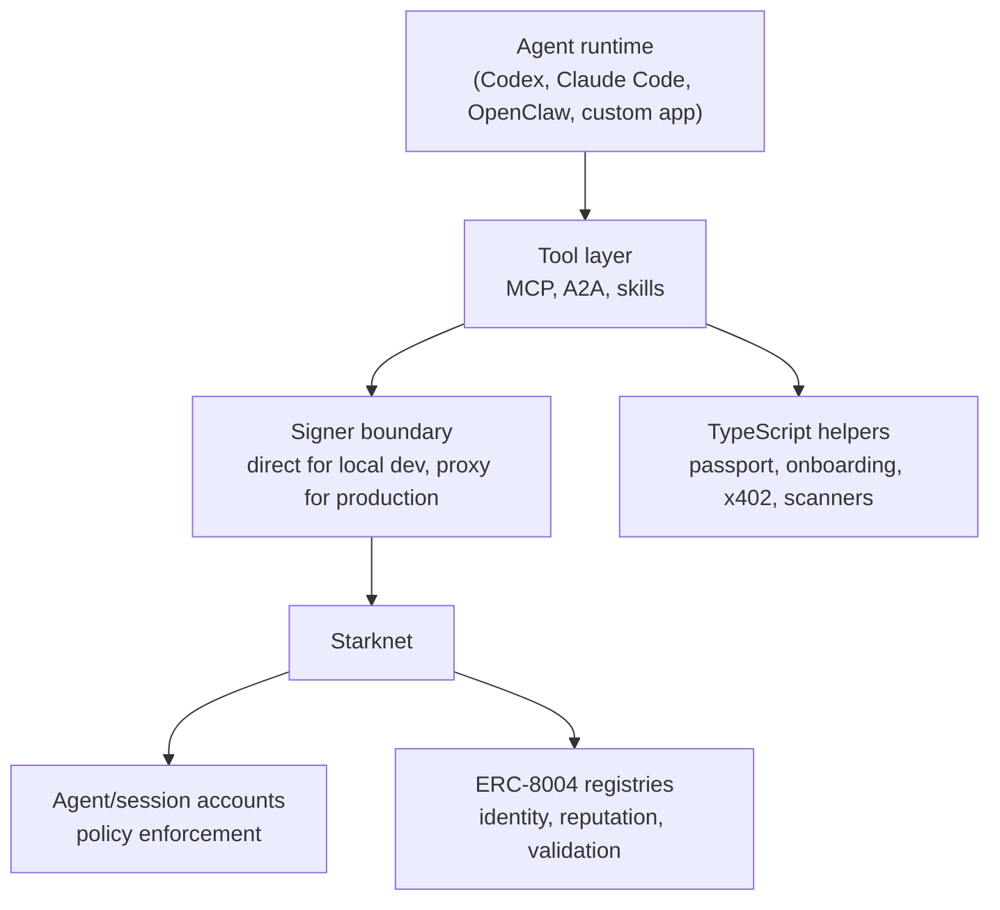

# Starknet Agentic

[](https://github.com/keep-starknet-strange/starknet-agentic/actions/workflows/ci.yml)
[](https://github.com/keep-starknet-strange/starknet-agentic/actions/workflows/codeql.yml)
[](./LICENSE)

Production-grade Starknet agent infrastructure: secure Cairo contracts, MCP/A2A runtimes, x402 payment helpers, end-to-end examples, and installable agent skills.

This repository is for developers building agents that need Starknet-native wallets, policy-enforced execution, on-chain identity, and composable tool access.

## Install & Use

### Scaffold a Starknet agent

```bash
npx @starknetfoundation/create-starknet-agent@latest
```

The scaffolder detects supported agent environments and wires Starknet integration into a new project.

### Install a skill

```bash
npx skills add keep-starknet-strange/starknet-agentic/skills/cairo-auditor
```

Codex public GitHub install:

```bash
CODEX_HOME="${CODEX_HOME:-$HOME/.codex}"
python3 "$CODEX_HOME/skills/.system/skill-installer/scripts/install-skill-from-github.py" \
  --repo keep-starknet-strange/starknet-agentic \
  --path skills/cairo-auditor \
  --ref main
```

Codex reproducible install:

```bash
CODEX_HOME="${CODEX_HOME:-$HOME/.codex}"
python3 "$CODEX_HOME/skills/.system/skill-installer/scripts/install-skill-from-github.py" \
  --repo keep-starknet-strange/starknet-agentic \
  --path skills/cairo-auditor \
  --ref <commit-sha>
```

Claude Code marketplace install:

```bash
/plugin marketplace add keep-starknet-strange/starknet-agentic
/plugin install starknet-agentic-skills@starknet-agentic-skills --scope user
```

For Codex, Claude Code, and pinned install flows, use the deterministic skill quickstart:

- [`skills/QUICKSTART_2MIN.md`](./skills/QUICKSTART_2MIN.md)
- [`skills/README.md`](./skills/README.md)
- [`skills/TROUBLESHOOTING.md`](./skills/TROUBLESHOOTING.md)

### Run the MCP server from source

From a source checkout after `pnpm install`:

```bash
pnpm --filter @starknetfoundation/starknet-agentic-mcp-server build
node packages/starknet-mcp-server/dist/index.js
```

Production deployments should use proxy signer mode rather than in-process private keys. See [`packages/starknet-mcp-server`](./packages/starknet-mcp-server/) and [`docs/security/SIGNER_API_SPEC.md`](./docs/security/SIGNER_API_SPEC.md).

## What Is Included

| Area | Path | Purpose |
|---|---|---|
| Cairo contracts | [`contracts/`](./contracts/) | Agent accounts, ERC-8004 registries, session-account primitives, and registry experiments |
| TypeScript packages | [`packages/`](./packages/) | CLI scaffolder, MCP server, A2A adapter, agent passport helpers, onboarding utilities, prediction scanner, and x402 helpers |
| Skills | [`skills/`](./skills/) | Public agent skills for Cairo auditing, Starknet wallets, DeFi, identity, testing, deployment, optimization, and SDK usage |
| Examples | [`examples/`](./examples/) | Reference agent flows covering onboarding, identity, MCP loops, DeFi, carry monitoring, controller calls, and cross-chain demos |
| Datasets and evals | [`datasets/`](./datasets/), [`evals/`](./evals/) | Cairo audit/evaluation corpora and deterministic benchmark material |
| Docs | [`docs/`](./docs/) | Architecture, roadmap, deployment status, security runbooks, and launch material |
| Website | [`website/`](./website/) | Documentation site source |

## Architecture



The recommended launch profile is self-custodial and no-backend:

- users run the agent runtime locally or on their own infrastructure
- account contracts enforce transaction policy on-chain
- production signer custody lives behind an explicit proxy/KMS/HSM boundary

## Core Components

### Contracts

| Component | Path | Description |
|---|---|---|
| Agent account | [`contracts/agent-account`](./contracts/agent-account/) | Session keys, spending policy enforcement, ownership controls, and upgrade safety checks |
| ERC-8004 Cairo | [`contracts/erc8004-cairo`](./contracts/erc8004-cairo/) | Identity, reputation, and validation registries adapted to Starknet |
| Session account | [`contracts/session-account`](./contracts/session-account/) | Session-key account primitives for policy-centric execution |
| Huginn registry | [`contracts/huginn-registry`](./contracts/huginn-registry/) | Starknet-native registry primitives used by ecosystem demos |

Deployment status is tracked in [`docs/DEPLOYMENT_TRUTH_SHEET.md`](./docs/DEPLOYMENT_TRUTH_SHEET.md). Treat that file as canonical for deployed class hashes, owners, and known drift.

### Packages

| Package | Path | Description |
|---|---|---|
| `@starknetfoundation/create-starknet-agent` | [`packages/create-starknet-agent`](./packages/create-starknet-agent/) | CLI scaffolder for Starknet agent projects |
| `@starknetfoundation/starknet-agentic-mcp-server` | [`packages/starknet-mcp-server`](./packages/starknet-mcp-server/) | MCP tools for Starknet balances, transfers, contract calls, swaps, paymaster flows, and policy-aware operations |
| `@starknetfoundation/starknet-agentic-a2a` | [`packages/starknet-a2a`](./packages/starknet-a2a/) | A2A protocol adapter for Starknet-native agents |
| `@starknetfoundation/starknet-agentic-agent-passport` | [`packages/starknet-agent-passport`](./packages/starknet-agent-passport/) | ERC-8004 capability metadata conventions and client helpers |
| `@starknetfoundation/starknet-agentic-onboarding-utils` | [`packages/starknet-onboarding-utils`](./packages/starknet-onboarding-utils/) | Shared onboarding preflight, deployment, and first-action helpers |
| `@starknetfoundation/starknet-agentic-prediction-arb-scanner` | [`packages/prediction-arb-scanner`](./packages/prediction-arb-scanner/) | Signals-only prediction market arbitrage scanner output model |
| `@starknetfoundation/starknet-agentic-x402-starknet` | [`packages/x402-starknet`](./packages/x402-starknet/) | Starknet x402 header encoding and payment-signature helpers |
| `@starknetfoundation/starknet-agentic-shared` | [`packages/shared`](./packages/shared/) | Private shared utilities used by workspace packages |

### Skills

The public catalog is maintained in [`skills/README.md`](./skills/README.md) and [`skills/manifest.json`](./skills/manifest.json).

| Skill | Best for |
|---|---|
| [`cairo-auditor`](./skills/cairo-auditor/) | Pre-merge Cairo security review with deterministic preflight and false-positive gating |
| [`cairo-contract-authoring`](./skills/cairo-contract-authoring/) | Workflow-first Cairo contract authoring and audit handoff |
| [`cairo-testing`](./skills/cairo-testing/) | `snforge` testing patterns, cheatcodes, fuzzing, and fork testing |
| [`cairo-optimization`](./skills/cairo-optimization/) | Profile-driven Cairo optimization after correctness tests pass |
| [`starknet-wallet`](./skills/starknet-wallet/) | Wallet operations, transfers, session keys, and paymaster flows |
| [`starknet-defi`](./skills/starknet-defi/) | Swaps, DCA, staking, lending, and AVNU routing patterns |
| [`starknet-identity`](./skills/starknet-identity/) | ERC-8004 identity, reputation, and validation flows |
| [`snip-36`](./skills/snip-36/) | Virtual block proving and off-chain Starknet proof verification workflows |
| [`starknet-js`](./skills/starknet-js/) | Starknet.js v9 application, account, transaction, and paymaster guidance |

## Examples

| Example | What it proves |
|---|---|
| [`examples/hello-agent`](./examples/hello-agent/) | Minimal RPC, state read, and transaction path |
| [`examples/onboard-agent`](./examples/onboard-agent/) | Agent account deployment, identity registration, and receipt artifacts |
| [`examples/full-stack-swarm`](./examples/full-stack-swarm/) | Autonomous loop with MCP tools, signer boundary, AVNU gasless flow, and ERC-8004 |
| [`examples/secure-defi-demo`](./examples/secure-defi-demo/) | Security evidence, session-key policy rejection, and Vesu flow artifact |
| [`examples/defi-agent`](./examples/defi-agent/) | DeFi strategy agent with routing and risk controls |
| [`examples/carry-agent`](./examples/carry-agent/) | Deterministic carry monitor and decision artifacts |
| [`examples/crosschain-demo`](./examples/crosschain-demo/) | Cross-chain ERC-8004 demo across Base Sepolia and Starknet |
| [`examples/erc8004-validation-demo`](./examples/erc8004-validation-demo/) | Validation request/response and summary extraction |
| [`examples/controller-calls`](./examples/controller-calls/) | Non-custodial unsigned-call flow with external signer execution |
| [`examples/starkzap-onboard-transfer`](./examples/starkzap-onboard-transfer/) | Starkzap gasless onboarding and STRK transfer flow |

## Requirements

| Use case | Requirements |
|---|---|
| CLI scaffolder | Node.js `>=18.0.0` |
| Source checkout | Node.js `>=20.9.0`, `pnpm` `>=10.28.2` |
| Cairo contracts | Scarb `>=2.14.0`, Starknet Foundry `snforge` `>=0.54.1` |
| Networked examples | Starknet RPC URL, account address, and signer configuration |

Copy [`./.env.example`](./.env.example) where an example or package asks for local environment variables. Never commit private keys or funded credentials.

## Contributor Workflow

Install workspace dependencies:

```bash
pnpm install
```

Build and test TypeScript packages:

```bash
pnpm build
pnpm test
```

Faster package-only path:

```bash
pnpm -r --filter "./packages/*" build
pnpm -r --filter "./packages/*" test
```

Run Cairo checks for contract changes:

```bash
failed=0
for dir in contracts/erc8004-cairo contracts/huginn-registry contracts/agent-account contracts/session-account; do
  if ! (cd "$dir" && scarb build && snforge test); then
    echo "Cairo checks failed in $dir"
    failed=1
    break
  fi
done
[ "$failed" -eq 0 ]
```

Run skill and distribution checks for skill/install UX changes:

```bash
python3 scripts/quality/validate_skills.py
python3 scripts/skills_manifest.py --check
python3 scripts/quality/check_codex_distribution.py
python3 -m unittest scripts/quality/test_codex_distribution.py
python3 scripts/quality/validate_marketplace.py
```

## Security and Release Integrity

- Security policy: [`SECURITY.md`](./SECURITY.md)
- Production deployment runbook: [`docs/security/PRODUCTION_DEPLOYMENT_RUNBOOK.md`](./docs/security/PRODUCTION_DEPLOYMENT_RUNBOOK.md)
- Signer proxy rotation: [`docs/security/SIGNER_PROXY_ROTATION_RUNBOOK.md`](./docs/security/SIGNER_PROXY_ROTATION_RUNBOOK.md)
- Mainnet ownership signer policy: [`docs/security/MAINNET_OWNERSHIP_SIGNER_POLICY.md`](./docs/security/MAINNET_OWNERSHIP_SIGNER_POLICY.md)
- External audit scope: [`docs/security/EXTERNAL_AUDIT_SCOPE.md`](./docs/security/EXTERNAL_AUDIT_SCOPE.md)

Release artifacts should be verified with GitHub attestations when available:

```bash
gh attestation verify <artifact-file> --repo keep-starknet-strange/starknet-agentic
```

## Documentation

| Topic | Link |
|---|---|
| Getting started | [`docs/GETTING_STARTED.md`](./docs/GETTING_STARTED.md) |
| Technical specification | [`docs/SPECIFICATION.md`](./docs/SPECIFICATION.md) |
| Roadmap | [`docs/ROADMAP.md`](./docs/ROADMAP.md) |
| ERC-8004 parity | [`docs/ERC8004-PARITY.md`](./docs/ERC8004-PARITY.md) |
| Cairo skills migration | [`docs/CAIRO_SKILLS_MIGRATION.md`](./docs/CAIRO_SKILLS_MIGRATION.md) |
| E2E testing | [`docs/E2E_TESTING_GUIDE.md`](./docs/E2E_TESTING_GUIDE.md) |
| Troubleshooting | [`docs/TROUBLESHOOTING.md`](./docs/TROUBLESHOOTING.md) |
| Good first issues | [`docs/GOOD_FIRST_ISSUES.md`](./docs/GOOD_FIRST_ISSUES.md) |

## Repository Layout

```text
starknet-agentic/
|-- .agents/        # Local agent discovery entrypoints
|-- contracts/      # Cairo contracts and tests
|-- packages/       # TypeScript packages
|-- skills/         # Installable agent skills
|-- examples/       # End-to-end demos and reference flows
|-- datasets/       # Audit/eval source datasets
|-- evals/          # Deterministic evaluation fixtures
|-- docs/           # Architecture, security, and launch docs
|-- scripts/        # Quality, release, and audit support scripts
`-- website/        # Documentation website
```

## Contributing

See [`CONTRIBUTING.md`](./CONTRIBUTING.md). Keep changes narrow, testable, and aligned with [`AGENTS.md`](./AGENTS.md), which is the canonical workflow file for automated coding agents in this repository.

## License

MIT. See [`LICENSE`](./LICENSE).
